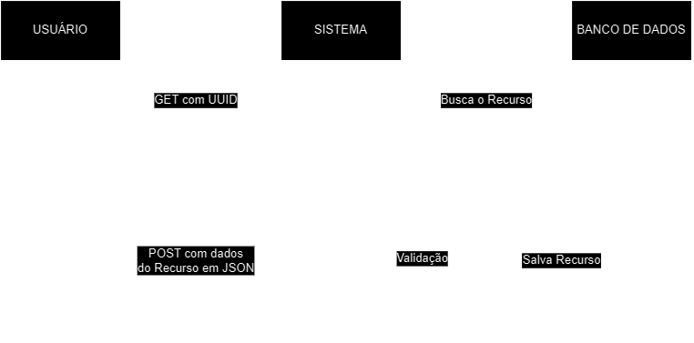
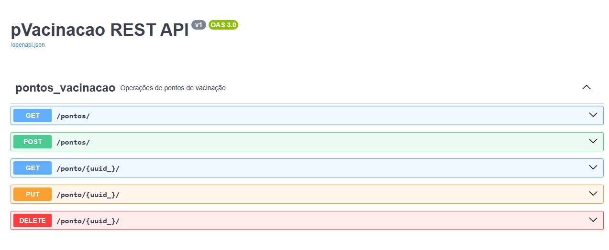

# PVacinação
## Descrição
Esse repositório contém um projeto de desenvolvimento de uma API RESTful proposto pela faculdade CESMAC.

Consiste em desenvolver um serviço de busca para pontos de vacinação em Maceió, onde atualmente essa busca pode ser feita porém é mais difícil do que deveria, encontramos pouquíssimas informações e também desatualizadas.

A solução proposta ajuda a listar esses pontos de vacinação, padronizando os dados e centralizando-os em um banco de dados único, também é possível fazer a busca por bairro de Maceió, e o sistema conta com busca de proximidade onde caso não haja ponto de vacinação no bairro buscado, retorna os possíveis pontos nos 2 bairros mais próximos de acordo com a Região Administrativa. [(clique aqui)](https://www.participa.maceio.al.gov.br/participa-maceio/regiaoAdministrativas.faces)

## Representação do sistema como arquitetura ROA


## Tecnologias usadas
1. Flask, com flask, flask-smorest e marshmallow
2. SQLAlchemy para interação com banco de dados
3. MySQL
4. alembic para gerenciar migrações do banco de dados

A aplicação tem suporte ao Swagger UI portanto você pode acessar **.../swagger-ui** para checar a documentação da aplicação.



> [!NOTE]
> A documentação pode não estar completa visto que não configurei totalmente o swagger e também não possuo conhecimento para tal.

## Como replicar e rodar a aplicação
1. Clonar repositório
2. Criar um ambiente virtual python com ```py -m venv venv```
3. Iniciar o ambiente virtual (essa etapa pode ser diferente dependendo do seu sistema operacional):
```
.\venv\Scripts\activate
```
4. Instalar as dependências do projeto com ```pip install -r requirements.txt```
5. Ter em mãos as credênciais para autenticação em um banco de dados MYSQL
7. Criar um arquivo na raiz do diretório chamado **.flaskenv**
8. Adicionar as seguintes variáveis necessárias:
```
FLASK_APP=app
FLASK_DEBUG=1
DB_USER=usuario
DB_PASSWORD=senha
DB_NAME=nome_banco
DB_HOST=host
DB_PORT=port
```
> [!NOTE]
> Para um banco mysql rodando localmente só precisaremos definir DEBUG ativo, das credênciais para o banco e do nome do banco.
8. Utilizar os comandos para criar a estrutura do banco de dados:
```
flask db upgrade
flask db migrate
```

9. Rodar o servidor da aplicação utilizando o comando ```flask run```

## Como popular o banco de dados
Após configurar o ambiente e certificar-se que está rodando podemos popular o banco com o comando:
```
python manage.py load
```
Ele utilizará o dump.json para criar os registros no banco de dados.
   
## Utilização
Para utilizar a aplicação para enviar o e-mail você pode usar as endpoints no método POST:
1. ```/pontos/```
Para get ou post
* GET aceita "bairro" como query param.
2. ```/ponto/{uuid}```
Para get, put ou delete.
* GET retorna o ponto de vacinação especificado.
* PUT atualiza o ponto de vacinação com dados enviados no BODY.
* DELETE deleta a informação do ponto de vacinação.

### Definição do body
Requer que o body seja um JSON
```
{
  "nome": "string",
  "bairro": "string",
  "endereco": "string",
  "horario_expediente": "string",
  "faixa_etaria": "string"
}
```
